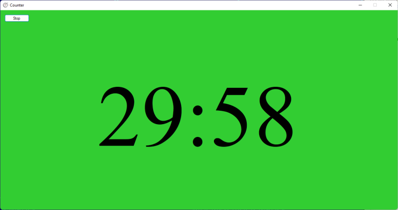

# Talker Counter #

Talker Counter is an app for doing time managing during talks/presentations and discussions. It has two modes of operation:

* A countdown timer on green background (should be used during the talk).
* A count-up timer on red background (should be used during discussion). Once countdown is finished, the count-up starts. 

User can select time in minutes for both modes via settings.

## Motivation ##

Imagine you are running a conference and need to keep track of time for people presenting. Sure you can use an alarm clock on you phone. The main problem with that is that it is invisible for the presenter. The presenter doesn't know how much time is left. Talker Counter makes it a bit better: not only there is a watch in big size, but there is a green background indicating that there is still time. Once background turns red, the presenter knows the state has changed.

### How to use ###

The interaction with application is performed via keyboard shortcuts:

* F - toggle fullscreen mode.
* H - show help dialog.
* S - start or stop countdown.
* Ctrl+P - show preferences dialog.

Additionally there is a Start/Stop button, which is used to start and stop countdown timer.